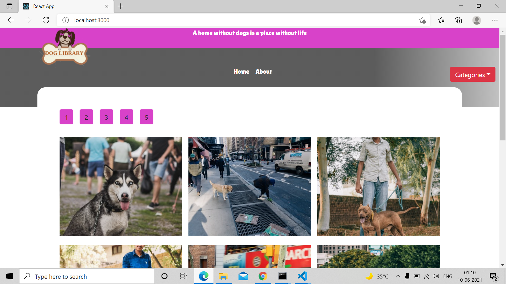

<h3 align="center">Catalogue of Statistics</h3>

Catalogue of Statistics app in React is a practice project, which includes manipulating dynamically the Virtual DOM and, use States and Props (useState Hook) and useEffect Hook to change the information accordingly with the user interactions. All photos are retrieved from Unsplash API and the information kept on a Redux store available on all application components. In order to test the React Components, I use Jest and React Testing Library. Built with React, JavaScript, HTML5, CSS3, Bootstrap, Redux and Prop-types.

## App Screenshot

## Live Link Demo

[Catalogue of Statistics](https://peaceful-bardeen-ac96b8.netlify.app)

## Built With

- React
- HTML5
- CSS3
- Bootstrap
- JavaScript
- Jest
- React Testing Library
- Redux
- Redux thunk

## Getting Started

To get a local copy up and running follow these simple example steps.

### Prerequisites

- Text Editor (VSCode is suggested.)

### Setup

- Install [git](https://git-scm.com/downloads)
- Open Terminal
- Change directory to folder to download repository
- Use `cd <file-path>`
- Run `git clone https://github.com/imran5644/react-catalogue-capstone.git`
- Enter the project's folder `cd react-catalogue-capstone`
- This projects uses the Unsplash API to get photos. 
  In order to use it you need to create an account as a developer on their website [Unsplash developers](https://unsplash.com/developers). After create the account, kindly create an App [Unsplash APP](https://unsplash.com/oauth/applications)
  to get the Acess Key.
  Add the Acess Key on a .env file on the root folder of the project following the pattern
  `REACT_APP_UNSPLASH_API_KEY=$API_KEY`. Change ${API_KEY} with your Acces Key from Unsplash.
  

To make any change,

- Open related file by using text editor.

## Usage
  - Run `npm start` on your terminal to open the server automatically on your browser
  - If it doesn't open automatically go to your browser and type the url `http://localhost:3000`
  - If you prefer to use the production minified JavaScript file run `npm run build` to create the build folder with the distribution files that can be served on your server.

## Test
  - Run `npm run test` to perform unit tests, also tests if React components are being correctly rendered;

  
## Author

👤  **Imran Yousaf**

- GitHub: [@imran5644](https://github.com/imran5644)
- Twitter: [@imran56444](https://twitter.com/imran56444)
- LinkedIn: [Imran Yousaf](https://www.linkedin.com/in/imranyousaf-programmer/) 

## 🤝 Contributing

Contributions, issues and feature requests are welcome! Start by:

- Forking the project
- Cloning the project to your local machine
- `cd` into the project directory
- Run `git checkout -b your-branch-name`
- Make your contributions
- Push your branch up to your forked repository
- Open a Pull Request with a detailed description to the development branch of the original project for a review

## Show your support

Give a ⭐️ if you like this project!

## Acknowledgments

- React
- Bootstrap
- W3Schools
- Font Awesome
- Javascript
- Jest
- React Testing Library
- Redux
- Redux-thunk
- Unsplash

## 📝 License

This project is [MIT](LICENSE) licensed.
